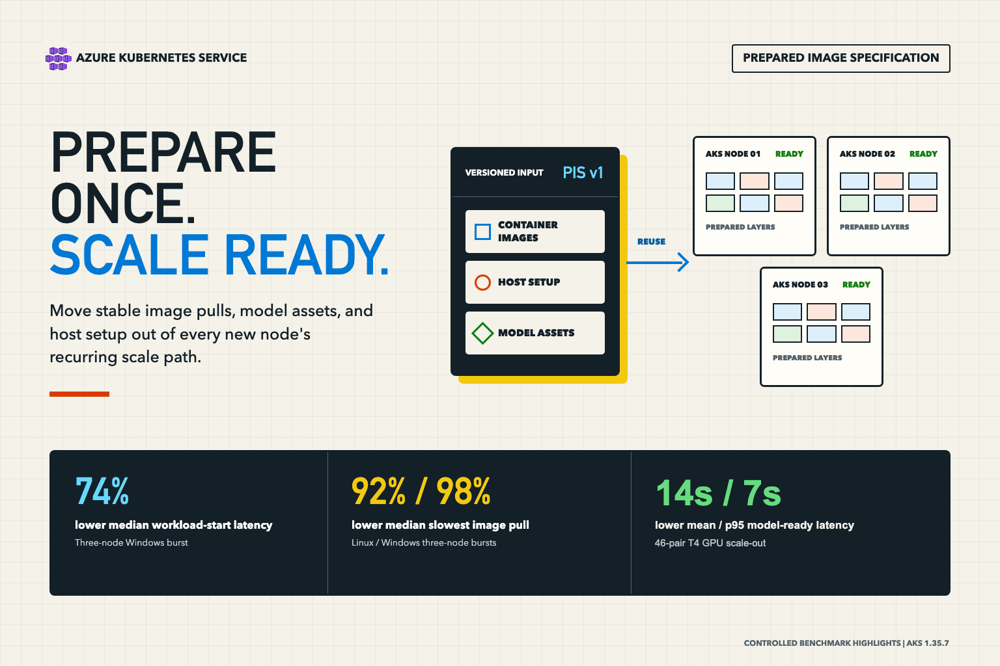

When an Azure Kubernetes Service (AKS) cluster needs more capacity, creating a virtual machine (VM) is only the beginning. The node still has to join the cluster, become Ready, prepare its host dependencies, pull container images, and start a workload before it can serve traffic.

That delay has a customer cost. Teams often keep extra nodes running to absorb bursts, accept slower recovery when demand changes, or build complex bootstrap automation that every new node must repeat.

Prepared Image Specification (PIS) moves stable, repeated preparation into an AKS-managed node image. Container images and host customizations are prepared once, versioned, and reused by a node pool. New nodes still have to be created and join the cluster, but they can avoid repeating much of the work between node creation and workload readiness.

<!-- truncate -->



The results below compare otherwise-equivalent standard and PIS-backed pools. A reduction means the PIS-backed path reached the measured outcome sooner. Mean saved is the average same-round difference, while p90 and p95 show tail latency. Times are rounded to whole seconds.

In our controlled comparisons, the strongest end-to-end result was a Windows burst that added three nodes: PIS reduced median time to start all three workloads by **74%**. PIS also reduced the median slowest image pull by **92% on Linux** and **98% on Windows**. For a T4 graphics processing unit (GPU) model-serving pool, PIS reached model readiness and returned the first token **14 seconds sooner on average** across 46 paired scale-outs. At p95, model readiness was **503 seconds with PIS versus 510 seconds without it**, and first token was **537 versus 543 seconds**. Once the GPU was allocatable, PIS returned the first token **27 seconds sooner on average**.

> **Preview notice:** PIS is currently an AKS preview feature. Preview features are opt-in, provided as-is and as-available, and not intended for production use. Review the current prerequisites, regions, limitations, and support policy before testing it.

## What Prepared Image Specification changes for customers

A PIS is an AKS-managed, versioned Azure resource that describes container images and Bash or PowerShell customizations to include in a prepared AKS node image. AKS builds on a supported AKS node image; this is not a bring-your-own-image workflow.

The tradeoff is timing: spend preparation time and operational effort when a PIS-backed pool is created or updated, then avoid repeating the same downloads and initialization during later scale-outs.

| Customer goal | How PIS helps |
| --- | --- |
| Respond to demand sooner | New nodes can start with large image layers and stable host dependencies already present. |
| Reduce warm-capacity pressure | A faster, more predictable scale-out path may let a team hold fewer idle nodes solely as a cold-start buffer. |
| Eliminate repeated bootstrap work | Build stable host setup into a reusable image instead of running it again on every new node. |

PIS does not remove VM allocation, node registration, networking, scheduling, driver initialization, or application startup. Its value depends on how much of the customer-visible delay comes from work that can be prepared ahead of time.

## What the results mean for customers

The table separates the customer-visible outcomes. Reductions mean the PIS-backed path completed sooner; the final row shows the one median regression.

| Scenario | Customer-visible outcome | Observed result |
| --- | --- | ---: |
| Add three Windows nodes | All three workloads started on distinct new nodes | **74% at median**<br />**78% at p90** |
| Add one Windows node | Workload started on the new node | **27% at median**<br />**77% at p90** |
| Add three Linux nodes | All three workloads started on distinct new nodes | **4% at median**<br />**24% at p90** |
| Large image pulls during a three-node burst | Slowest new-node pull completed | **92% at Linux median**<br />**98% at Windows median** |
| Install a pinned portable runtime | Runtime verified and workload started | **10% at Linux median**<br />**34% at Windows median** |
| Prepare a large dependency bundle | Dependencies verified and workload started | **20% at Linux median**<br />**5% at Windows median** |
| Serve a model on a T4 GPU node | Model healthy and first token returned | **14 seconds sooner on average to model ready and first token**<br />**At p95: 503 vs. 510 seconds to model ready**<br />**At p95: 537 vs. 543 seconds to first token**<br />(PIS vs. non-PIS) |
| Reuse prepared assets after the GPU is allocatable | First token returned<br />Container started after preparation checks | **27 seconds sooner to first token on average**<br />**86 seconds sooner to container start on average** |
| Apply a small Linux certificate authority (CA) and policy setup | Setup verified and workload started | **14% slower at median**<br />**Tail latency favored PIS** |

### How to read these results

Each result compares matched standard and PIS-backed pools. The timer starts with the scale request and stops at the outcome in the table; PIS creation and initial pool setup are not included.

Image tests used 100 rounds per arm, customization tests used 10 same-round pairs per cell, and the GPU test used 46 pairs that concurrently scaled matched pools from one to two nodes. VM size, AKS node image, networking, artifacts, and workload were held constant.

The GPU timer includes VM provisioning, node registration, managed driver readiness, model loading, health, and first token. PIS reached GPU allocatable 13 seconds later on average, but then returned the first token 27 seconds sooner. Once preparation checks finished, its preloaded image started the container 86 seconds sooner: 11 seconds with PIS versus 97 seconds without it.

These are controlled observations, not service-level objectives. The 10-pair tail results are directional, and the tests did not measure cost savings, production traffic, autoscaler decisions, cross-region variation, throughput, upgrades, or long-lived drift. PIS helps when the prepared work is material; the small Linux setup shows that baking a task is not automatically faster.

## When to use PIS

Start with work that every new node repeats and that can be completed before the node joins a pool. A strong candidate is:

- **Stable:** It changes less often than the pool scales.
- **Material:** Its download or installation time affects workload readiness.
- **Deterministic:** Its inputs can be versioned, pinned, and verified.

Large, digest-pinned images, portable runtimes, dependency bundles, security tools, and immutable model artifacts can fit this profile. Keep frequently changing, node-specific, or inexpensive setup on the normal startup path.

For GPU pools, measure the operating event that matters to the workload. This benchmark covered scale-out through the first successful inference; it did not test operating system upgrades or disruption while GPU nodes are replaced.

## How to adopt PIS

1. **Record a control path.** Measure image pulls, host setup, node readiness, workload readiness, and any model-serving milestones on a standard pool.
2. **Choose one preparation target.** Start with a stable image or dependency that contributes materially to that path.
3. **Create a versioned PIS.** Pin image digests, verify downloaded artifacts, and record exactly what the version contains.
4. **Create a matched nonproduction pool.** Keep the VM size, AKS node image, networking, and workload equal to the control pool.
5. **Repeat the same scale event.** Stop the clock when the workload can serve a representative request, not when infrastructure creation returns.
6. **Promote the tested version.** Update pools deliberately and retain a standard path for comparison and rollback.

### Create and attach a PIS

After registering the preview and configuring registry access and role-based access control (RBAC), create a version with pinned images, get its resource ID, and reference it from a node pool. See the [PIS how-to](https://learn.microsoft.com/azure/aks/prepared-image-specification) for current prerequisites and feature-registration steps.

```bash
RESOURCE_GROUP="my-resource-group"
PIS_NAME="my-pis"
PIS_VERSION="v1"
CLUSTER_NAME="my-aks-cluster"

LOCATION=$(az aks show \
  --resource-group "$RESOURCE_GROUP" \
  --name "$CLUSTER_NAME" \
  --query location \
  --output tsv)

cat >scripts.json <<'JSON'
[
  {
    "name": "install-bootstrap",
    "script": "#!/usr/bin/env bash\nset -euo pipefail\nmkdir -p /opt/example\nprintf '%s\\n' 'v1' >/opt/example/version",
    "scriptType": "Bash",
    "executionPoint": "NodeImageBuildTime",
    "postScriptAction": "None"
  }
]
JSON

az aks prepared-image-specification create \
  --resource-group "$RESOURCE_GROUP" \
  --name "$PIS_NAME" \
  --version "$PIS_VERSION" \
  --location "$LOCATION" \
  --container-images "myacr.azurecr.io/model-server@sha256:<digest>" \
  --customization-scripts @scripts.json

PIS_VERSION_ID=$(az aks prepared-image-specification version show \
  --resource-group "$RESOURCE_GROUP" \
  --pis-name "$PIS_NAME" \
  --name "$PIS_VERSION" \
  --query id \
  --output tsv)

az aks nodepool add \
  --resource-group "$RESOURCE_GROUP" \
  --cluster-name "$CLUSTER_NAME" \
  --name userpool \
  --prepared-image-specification-id "$PIS_VERSION_ID"
```

For Windows, use PowerShell and set `scriptType` to `PowerShell`. Keep secrets out of scripts and use managed identity with data-plane RBAC for private registries and artifacts.

## Conclusion

PIS is most useful when new nodes repeatedly pull large images, fetch models, or run stable host setup before workloads can serve. It shifts that work to a versioned image build so later scale-outs can be faster and more predictable. Because PIS is in preview, validate it in matched nonproduction pools before adoption.

## Resources

- [Prepared Image Specification overview](https://learn.microsoft.com/azure/aks/prepared-image-specification-overview)
- [Create and manage a Prepared Image Specification](https://learn.microsoft.com/azure/aks/prepared-image-specification)
- [AKS preview feature support policy](https://learn.microsoft.com/azure/aks/support-policies)
