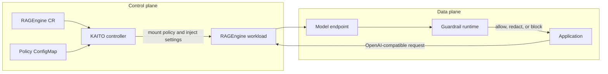
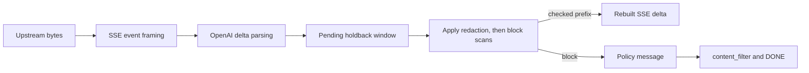
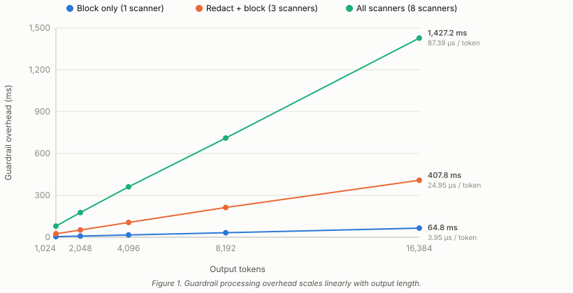

## Challenge: Grounded Does Not Mean Safe

An enterprise RAG application retrieves an internal troubleshooting document containing an API credential, an employee email address, and a confidential project name. Retrieval improves the answer, but the model may also reproduce that information, potentially token by token through a streaming API.

Deterministic scanners can block or redact recognizable risks such as credentials, personal information, invisible Unicode, and prohibited terms. Semantic risks, including unsupported answers, toxicity, topic violations, and instruction overrides, require model-based evaluation rather than pattern matching alone.

> **Grounding gives the model relevant evidence for its response. Guardrails enforce what content the application is allowed to return.**

KAITO RAGEngine currently provides centrally managed output guardrails for standard and streaming responses, with blocking, redaction, hot reload, metrics, and structured logs. This post configures and evaluates those controls on Azure Kubernetes Service (AKS), explains cross-chunk protection, and considers future semantic checks. RAGEngine does not currently scan user input or retrieved context or provide model-based scanners.

<!-- truncate -->

## Why Application-Level Filters Do Not Scale

An application can call a filtering library before returning a model response. For a single service, that may be sufficient. At platform scale, however, application-level filtering creates three problems.

First, every team must independently implement scanner initialization, policy parsing, enforcement actions, failure handling, streaming logic, metrics, and logging. Over time, these implementations and policy versions can become inconsistent across services.

Second, streaming responses require safety-aware buffering and delayed emission. If an application scans and forwards each SSE chunk independently, unsafe content may already be visible before the complete value can be detected, especially when it spans chunk boundaries.

```text
Model -> SSE chunks -> Client
                       ^
                       unsafe content may already be visible
```

A streaming guardrail therefore cannot simply scan each chunk independently. It must retain an uncommitted suffix, scan across chunk boundaries, and emit only content that has passed the applicable safety checks.

Third, policy changes become tied to each application's release cycle, often requiring repeated configuration changes, builds, and deployments across multiple services. With RAGEngine, the workflow becomes:

```text
Update ConfigMap -> reload policy at runtime -> keep using the same endpoint
```

RAGEngine centralizes these responsibilities on the OpenAI-compatible response path. It applies the active policy before output reaches the client, performs safe buffering and cross-chunk inspection for streaming responses, and allows applications to continue using the same endpoint.

## Guardrails as a RAGEngine Runtime Capability

RAGEngine separates policy management from response enforcement. The control plane configures guardrails through Kubernetes; the data plane applies the active policy before assistant output reaches the client.

This separation keeps scanner lifecycle out of application code and applies a shared enforcement model across supported chat-completion paths.

RAGEngine integrates and adapts scanners from [Protect AI's LLM Guard](https://github.com/protectai/llm-guard) for deterministic output checks. Around those scanners, RAGEngine provides Kubernetes-managed policy lifecycle, OpenAI-compatible response-path enforcement, streaming-safe holdback and cross-chunk handling, hot reload, metrics, and structured logs.



Users enable the feature with `spec.guardrails.enabled` and optionally select a policy ConfigMap through `configMapRef`. The controller resolves and mounts the policy and injects the enabled state and path. Applications continue calling the same OpenAI-compatible endpoint without loading scanners or adding filtering code.

At runtime, RAGEngine parses the YAML, validates scanner settings, and builds the pipeline. Unsupported, invalid, or incompatible policy entries are skipped and reported. Scanner construction failures are logged and excluded from the active pipeline, while response-scanning failures fail closed rather than returning unscanned output.

Policy and application releases have separate lifecycles. When the mounted policy changes, the policy reloader builds a new snapshot and atomically replaces the active one. A reloader failure keeps the current snapshot and reports the outcome without restarting the Pod.

The `/v1/chat/completions` endpoint scans complete non-streaming responses. Streaming responses use SSE parsing and a safety-aware holdback window. Streaming requests are accepted only when the active policy uses supported scanner/action combinations; unsupported streaming configurations are rejected rather than silently bypassed.

Both paths share the same active policy model. Metrics expose policy loads and reloads, scanner construction, and enforcement outcomes; the non-streaming path additionally records per-scanner hits. Enforcement currently covers assistant text only.

## Configure Policy-Driven Output Protection

A policy combines three elements: `type` selects the risk, `action` chooses `block` or `redact`, and scanner-specific options define detectors, substrings, matching, or limits. One policy can therefore redact credentials and personal information while blocking an internal project name.

This ConfigMap is compatible with non-streaming and streaming responses:

```yaml
apiVersion: v1
kind: ConfigMap
metadata:
  name: ragengine-guardrails-policy
data:
  guardrails.yaml: |
    blockMessage: The response was blocked by output guardrails.
    scanners:
      - type: secrets
        action: redact
        redact_mode: all
      - type: sensitive
        action: redact
        detectors:
          - email
          - phone
          - credit_card
          - ip_address
      - type: invisible_text
        action: redact
      - type: ban_substrings
        action: block
        substrings:
          - SECRET_PROJECT
        match_type: word
        case_sensitive: false
```

Table 1 lists each scanner type and its availability across non-streaming and streaming response paths. Scanners marked "No" are currently supported only on the complete non-streaming response path and are not available for incremental streaming enforcement.

*Table 1. Scanner availability by response path.*

| Scanner | Non-streaming | Streaming |
| --- | --- | --- |
| `ban_substrings` | Yes | Yes |
| `secrets` | Yes | Yes |
| `sensitive` | Yes | Yes |
| `invisible_text` | Yes | Yes |
| `regex` | Yes | No |
| `json` | Yes | No |
| `reading_time` | Yes | No |
| `token_limit` | Yes | No |

Streaming secret redaction requires `redact_mode: all` and a single choice at index `0`; an incompatible policy is rejected for streaming. For non-streaming output, scanners run in policy order, so redaction can change what later scanners observe. Streaming applies compatible redactions before block checks within each window. Test the combined policy, not only individual scanners.

## Protect Streaming Responses Across Chunk Boundaries

Buffering a complete response gives scanners full context but removes incremental delivery. Scanning and forwarding each chunk is responsive, but network chunks are not policy boundaries: a prohibited value can span chunks, and released text cannot be retracted.

For example, an AWS access key ID can arrive as:

```text
Chunk 1: "The API key is AKIA12"
Chunk 2: "34567890123456."
```

Neither chunk contains the complete value. RAGEngine instead retains the newest text in a holdback window.



RAGEngine frames OpenAI-compatible SSE events, extracts textual `delta.content`, appends it to pending text, and scans the combined window. It releases only the prefix outside the holdback boundary, allowing the scanner to see `AKIA1234567890123456` as one candidate. The retained tail remains bounded rather than growing with the complete response.

At `finish_reason`, `[DONE]`, or upstream end, RAGEngine flushes and scans the remaining window. A block discards pending text and emits the policy message, an OpenAI `content_filter` finish reason, and `[DONE]`.

Redaction can change text length, so offsets derived from the original content are unsafe. RAGEngine replaces pending text with the sanitized result and recalculates the releasable prefix, preventing partial, duplicated, or missing output.

Word matching requires both boundaries. With `match_type: word`, `SECRET_PROJECT is active` matches, while `MY_SECRET_PROJECT_ARCHIVE` does not. RAGEngine retains the preceding emitted character for the left boundary. If the right character has not arrived, the candidate remains pending; flush treats the response end as the final boundary.

Secret redaction adds an additional verification step: RAGEngine scans the sanitized result again and fails closed if it cannot confirm that the secret was removed.

Malformed SSE or unexpected multi-choice events fail closed with a streaming refusal. Unsupported scanner/action combinations are rejected before streaming begins rather than silently bypassed.

The holdback is a safety boundary, not only a delay. It prevents values that begin near an emission boundary from leaking before the runtime can determine whether later characters complete a secret or prohibited word. Policies with longer banned substrings increase the retained tail, trading first-visible-token latency for a wider detection boundary.

The default holdback is 256 characters and increases when required by the configured banned substrings, providing adjacent context without retaining the complete response.

RAGEngine therefore treats streaming output as a continuous text stream and releases only content that has passed the applicable safety checks.

## See Guardrails in Action

Applications keep the same OpenAI-compatible endpoint and request shape; the active guardrail policy determines how assistant output is handled.

### Redact sensitive data

The `sensitive` scanner removes detected values while preserving the rest of the answer:

```text
Without: Email alice@example.com, call +1 (206) 555-0100,
         use 4111 1111 1111 1111 from 10.0.0.1.

With:    Email <EMAIL>, call <PHONE>,
         use <CREDIT_CARD> from <IP_ADDRESS>.
```

With `action: redact`, RAGEngine returns the remaining context normally.

The request body and endpoint are unchanged; the scanner action affects only the returned assistant text.

### Redact a secret split across chunks

Suppose the model splits an AWS access key across two SSE deltas:

```text
Upstream chunk 1: "AWS key: AKIA1234"
Upstream chunk 2: "567890ABCDEF"
```

With the policy shown above and `redact_mode: all`, the holdback window combines and scans pending text before release. Table 2 traces how the upstream chunks, the pending window, and the client-visible output relate: the holdback window accumulates the full key before any part of the key is released, so the client receives only the sanitized form.

*Table 2. Cross-chunk secret redaction example.*

| Upstream | Pending window | Client-visible output |
| --- | --- | --- |
| Secret split across chunks | `AKIA1234567890ABCDEF` | `AWS key: ******` |

The client never receives the first half. The complete secret appears in no downstream chunk, even though the upstream value crosses an SSE event boundary.

### Block a prohibited term

With `ban_substrings`, `action: block`, and `match_type: word`, `SECRET_PROJECT` produces:

```text
This response was blocked by output guardrails.
finish_reason: content_filter
[DONE]
```

`SECRET_PROJECT_ARCHIVE` does not match because the underscore continues the word.

On a match, RAGEngine discards pending original text before emitting the configured refusal sequence.

Add `CONFIDENTIAL_ALPHA` to the ConfigMap and RAGEngine reloads the updated policy without restarting the Pod or changing the endpoint. Reload metrics and active-policy metadata confirm the update.

## From Pattern Matching to Semantic Protection

Deterministic scanners protect known patterns, but a response can contain no secret, PII, prohibited term, or invalid JSON and still be irrelevant or unsupported by retrieved evidence.

Future model-based scanners could assess relevance, toxicity, or topic policy. Factual-consistency checks require retrieved evidence to be available as scanner context, while prompt-injection detection belongs on an input-side hook before retrieval and inference.

> **Model-based scanners should complement fast rule- and pattern-based checks rather than replace them.**

KAITO does not currently expose these scanners. Adding them requires context plumbing, threshold selection, fallback behavior, and measurement of quality, latency, and resource cost. Model-based scanners can account for broader context, but they also introduce additional latency and operational complexity.

## Evaluate Safety and Performance

Across the benchmark suite, we evaluated four profiles covering both non-streaming and streaming guardrail paths. Table 3 summarizes each configuration and the aspect of guardrail behavior it is designed to measure.

*Table 3. Benchmark configurations and their purposes.*

| Configuration | Purpose |
| --- | --- |
| No guardrails | Establish the latency baseline |
| Non-streaming guardrails | Measure full-response scanning cost |
| Streaming block only | Measure holdback and blocking overhead |
| Streaming redact and block | Measure sanitization overhead |

The benchmark used positive, negative, boundary, and malformed samples. We measured detection errors, redaction correctness, cross-chunk detection, and the defining streaming metric:

```text
Leakage bytes = bytes from detected policy-violating content delivered before enforcement
```

We verified valid SSE framing and used zero leakage as the acceptance criterion for detected policy violations. Model TTFT was separated from guardrail-induced first-visible-token delay. The benchmark collected P50, P95, and P99 latency, throughput, resource use, and reload-time measurements across allow, redact, and block paths.

### Benchmark Results

We evaluated RAGEngine output guardrails with 380 prompts across three Azure AI Foundry models: Phi-4-mini-instruct (3.8B), mistral-small-2503 (~24B), and Mistral-Large-3 (123B). The prompt set combines public safety datasets (63%) and custom prompts (37%), covering PII, toxicity, refusal boundaries, secrets, and clean baselines. Azure Content Safety remained enabled across all live runs. We compared the baseline with no RAGEngine guardrails against a block-only RAGEngine policy and a combined redaction-and-blocking policy.

#### Isolated guardrail processing adds millisecond-scale overhead

A deterministic microbenchmark isolates scanner execution from model inference and network variance. Figure 1 shows that guardrail processing overhead scales linearly with output length across all three configurations, from a single blocking scanner to all eight scanners enabled.



*Table 4. Guardrail processing rate by configuration (linear fit across 1,024–16,384 output tokens, 100 iterations per point).*

| Configuration | Rate (μs / token) |
| ------------- | ------------------ |
| Block only (1 scanner) | 3.95 |
| Redact + block (3 scanners) | 24.95 |
| All scanners (8 scanners) | 87.39 |

For a typical 512-token response, the block-only policy adds under 1 ms and the three-scanner policy adds approximately 3 ms. Even the worst case with all eight scanners enabled stays under 1.5 s at 16,384 tokens. In live runs against Phi-4-mini (3.67 s baseline) and mistral-small (2.84 s baseline), enabling guardrails produced no observable change in median end-to-end latency, consistent with microsecond-per-token processing overhead relative to multi-second model inference.

#### RAGEngine complements Azure Content Safety

Azure Content Safety and RAGEngine guardrails address different classes of risk. Azure Content Safety targets general harmful content categories such as hate speech, violence, sexual content, and self-harm. RAGEngine adds application-specific checks including PII redaction, secret detection, and custom prohibited terms. The two layers are complementary: Azure Content Safety provides a broad safety baseline, while RAGEngine enforces domain-specific policies that fall outside general content moderation.

Table 5 compares enforcement outcomes with Azure Content Safety alone versus the additional enforcement contributed by RAGEngine, broken down by action type.

*Table 5. Enforcement outcomes: Azure Content Safety alone vs. additional RAGEngine contribution.*

| Model | Azure Content Safety only | Extra by RAGEngine | Improvement |
| ----- | ------------------------- | ------------------ | ----------- |
| Phi-4-mini | 14 (block) | 10 (4 block + 6 redact) | +71% |
| mistral-small | 15 (block) | 9 (5 block + 4 redact) | +60% |
| Mistral-Large-3 | 18 (block) | 14 (5 block + 9 redact) | +78% |

RAGEngine contributed both additional blocking and PII redaction, including email addresses, phone numbers, credit-card numbers, and other sensitive values that Azure Content Safety does not handle as PII redaction.

#### Streaming checks prevented cross-chunk leakage

All 12 correctness checks passed, including prohibited values split at different SSE chunk boundaries, with zero bytes of detected policy-violating content released before enforcement.

Together, the results show that deterministic RAGEngine guardrails can add complementary output protection while keeping isolated runtime overhead in the millisecond range and preserving the streaming safety boundary.

## Operational Considerations and Current Scope

ConfigMaps, hot reload, fail-closed response scanning, metrics, and logs separate policy operations from application releases. Current enforcement covers assistant text; streaming supports a defined scanner/action subset and a single choice, while tool-call arguments, input scanning, and retrieved-context checks are outside scope.

> **Guardrails are one layer of defense, not a replacement for RBAC, network policies, secret management, data access controls, or secure retrieval design.**

## Conclusion

KAITO RAGEngine moves output guardrails from application-specific filtering into a shared runtime capability. Applications keep the same OpenAI-compatible API, platform teams manage policy through Kubernetes, and security teams gain consistent enforcement, metrics, and structured logs. Deterministic scanners and streaming holdback apply configured checks before assistant output is released, while the same runtime architecture provides a path toward future semantic checks.
