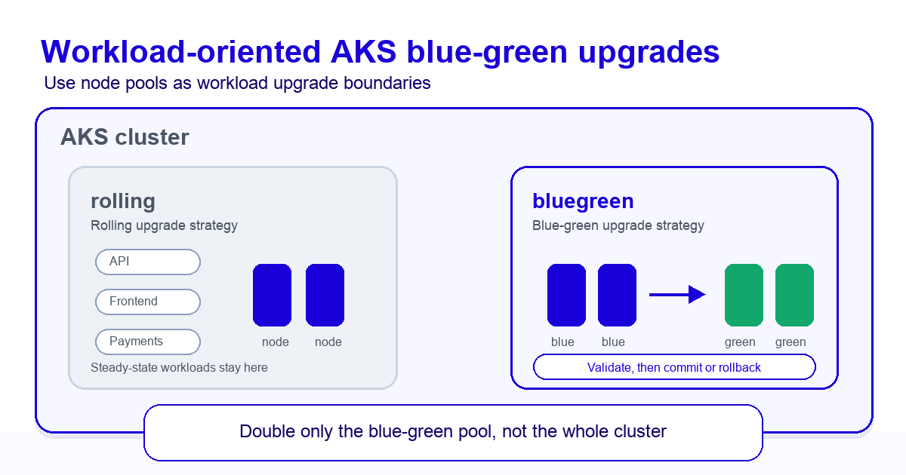

Blue-green upgrades are usually described as a safer way to update infrastructure: bring up the new environment, move traffic or workloads over, validate, and keep a rollback path open. In Azure Kubernetes Service (AKS), [blue-green node pool upgrades](https://learn.microsoft.com/azure/aks/blue-green-node-pool-upgrade) apply that model to node pools.

That raises an important design question: if the feature operates at the node-pool level, how do you make it workload-focused? Treat node pools as workload upgrade boundaries. Segment workloads across node pools, choose the right upgrade strategy for each pool, and use blue-green only where the validation and rollback benefits justify the temporary capacity, quota, and cost requirements.

<!-- truncate -->



## The problem with whole-cluster blue-green thinking

Blue-green upgrades require extra capacity during the upgrade window. AKS adds green nodes alongside the existing blue nodes, then drains workloads from blue to green in batches. This gives you a safer validation path, but it also means you temporarily run both sets of nodes.

If you apply that mental model to an entire cluster, blue-green can sound expensive or impractical:

- You need quota and regional capacity for the temporary nodes.
- You pay for both blue and green nodes during the upgrade.
- You extend the upgrade timeline to include batch and final soak periods.

Those tradeoffs are real. But they are also pool-scoped. The more useful question is not "Should this whole cluster use blue-green?" It is "Which workloads deserve a blue-green upgrade boundary?"

## A workload-aware node pool strategy

Most production AKS clusters already use more than one node pool. Platform teams separate workloads by VM SKU, GPU needs, Spot usage, compliance boundary, operating system, or validation and rollback requirements. Upgrade strategy can become another dimension of that design.

For example, imagine a cluster with two user node pools:

| Node pool | Workloads | Upgrade strategy | Why |
| --- | --- | --- | --- |
| `rolling` | Steady-state APIs, frontends, customer-facing services | Rolling | Mature availability patterns make rolling upgrades a good fit without adding temporary blue-green capacity. |
| `bluegreen` | Compatibility-sensitive services, internal platforms, workload canaries | BlueGreen | These workloads benefit from explicit validation on new nodes before the old nodes are removed. |

The pool names reflect the upgrade strategy, not workload importance. `rolling` uses standard rolling upgrades. `bluegreen` uses blue-green upgrades for workloads that benefit from explicit validation before the old nodes are removed.

This pattern changes the capacity and cost conversation. Instead of doubling the entire cluster, you only double the isolated blue-green pool that hosts validation-focused workloads.

## Example configuration

This example creates a cluster shape that makes the upgrade boundary visible:

1. A rolling pool that uses the default rolling upgrade strategy.
2. An isolated blue-green pool configured for blue-green upgrades.
3. A steady-state workload pinned to the rolling pool.
4. A validation-focused workload pinned to the blue-green pool.
5. A blue-green upgrade started only on the blue-green pool.

> **Note**: Blue-green node pool upgrades are currently in preview. Review the [AKS preview feature support policy](https://learn.microsoft.com/azure/aks/support-policies) before using preview features in production environments.

### Create the node pools

Start with an AKS cluster and add two user pools. The rolling pool uses the default rolling strategy. The blue-green pool uses blue-green and a short soak configuration for illustration.

An AKS node pool can't be upgraded beyond the Kubernetes version of the control plane. To keep this walkthrough focused on node pool behavior, create the cluster control plane on version N and create both workload node pools on version N-1. If you later swap the node image upgrade command for a Kubernetes version upgrade, the blue-green pool can move up to the already-upgraded control plane version without adding a separate control-plane-only upgrade step.

Blue-green node pool upgrades require Azure CLI 2.64.0 or later, the latest `aks-preview` extension, and the `2025-08-02-preview` AKS API version.

```bash
az version --query '"azure-cli"'
az extension add --name aks-preview --upgrade

RESOURCE_GROUP=rg-bluegreen-upgrades
CLUSTER_NAME=aks-bluegreen-upgrades
LOCATION=eastus
K8S_VERSION_CLUSTER=1.35.7
K8S_VERSION_NODEPOOL=1.34.10

az group create \
  --name $RESOURCE_GROUP \
  --location $LOCATION

az aks create \
  --resource-group $RESOURCE_GROUP \
  --name $CLUSTER_NAME \
  --location $LOCATION \
  --kubernetes-version $K8S_VERSION_CLUSTER \
  --node-count 1 \
  --generate-ssh-keys

az aks nodepool add \
  --resource-group $RESOURCE_GROUP \
  --cluster-name $CLUSTER_NAME \
  --name rolling \
  --node-count 2 \
  --kubernetes-version $K8S_VERSION_NODEPOOL \
  --labels workload-tier=rolling

az aks nodepool add \
  --resource-group $RESOURCE_GROUP \
  --cluster-name $CLUSTER_NAME \
  --name bluegreen \
  --node-count 2 \
  --kubernetes-version $K8S_VERSION_NODEPOOL \
  --labels workload-tier=bluegreen \
  --taints workload-tier=bluegreen:NoSchedule \
  --upgrade-strategy bluegreen \
  --drain-batch-size 50% \
  --batch-soak-duration 5 \
  --final-soak-duration 60

az aks get-credentials \
  --resource-group $RESOURCE_GROUP \
  --name $CLUSTER_NAME
```

For production, choose soak durations based on the time your monitoring, smoke tests, and users need to detect meaningful regressions.

### Place workloads intentionally

Next, schedule workloads onto the pool that matches their upgrade posture. The steady-state workload targets `workload-tier=rolling`.

```yaml
apiVersion: apps/v1
kind: Deployment
metadata:
  name: checkout-api
spec:
  replicas: 3
  selector:
    matchLabels:
      app: checkout-api
  template:
    metadata:
      labels:
        app: checkout-api
    spec:
      nodeSelector:
        workload-tier: rolling
      containers:
      - name: app
        image: mcr.microsoft.com/azuredocs/aks-helloworld:v1
        ports:
        - containerPort: 80
        resources:
          requests:
            cpu: "250m"
            memory: "256Mi"
          limits:
            cpu: "500m"
            memory: "512Mi"
```

The validation-focused workload targets the blue-green pool.

```yaml
apiVersion: apps/v1
kind: Deployment
metadata:
  name: recommendations-worker
spec:
  replicas: 4
  selector:
    matchLabels:
      app: recommendations-worker
  template:
    metadata:
      labels:
        app: recommendations-worker
    spec:
      nodeSelector:
        workload-tier: bluegreen
      tolerations:
      - key: "workload-tier"
        operator: "Equal"
        value: "bluegreen"
        effect: "NoSchedule"
      containers:
      - name: app
        image: mcr.microsoft.com/azuredocs/aks-helloworld:v1
        ports:
        - containerPort: 80
        resources:
          requests:
            cpu: "250m"
            memory: "256Mi"
          limits:
            cpu: "500m"
            memory: "512Mi"
```

The `nodeSelector` places this workload on the blue-green pool. The matching taint and toleration make the boundary stronger by preventing unrelated workloads without that toleration from scheduling there.

Confirm placement before starting the upgrade.

```bash
kubectl get pods -o wide
kubectl get nodes --show-labels | grep workload-tier
```

At this point, the steady-state service should be running on `rolling`, while the validation-focused workload should be running on `bluegreen`.

## Upgrade only the blue-green pool

Now start a node image upgrade on the blue-green pool. The rolling pool does not need to participate.

```bash
az aks nodepool upgrade \
  --resource-group $RESOURCE_GROUP \
  --cluster-name $CLUSTER_NAME \
  --name bluegreen \
  --node-image-only
```

During the upgrade, AKS cordons the blue nodes, adds green nodes with the updated configuration, and drains pods from blue to green in batches. Because only `bluegreen` uses blue-green, the temporary capacity increase applies to that pool.

Watch the node and pod movement in separate terminals:

```bash
watch kubectl get nodes -l workload-tier=bluegreen
```

```bash
watch kubectl get pods -l app=recommendations-worker -o wide
```

This is where the workload-focused story becomes visible. AKS does not infer application intent; you express it through node pool design and scheduling.

## Validate before the final commit

Blue-green upgrades are most useful when you do something with the soak window. Use that time to run validation against the workloads that moved to green nodes:

```bash
kubectl wait \
  --for=condition=Ready pod \
  -l app=recommendations-worker \
  --timeout=5m
kubectl get pods -l app=recommendations-worker -o wide
kubectl logs deployment/recommendations-worker --tail=50
```

In production, add checks that match your application:

- Synthetic requests through the service or ingress path.
- SLO and error-budget checks in Azure Monitor or your observability stack.
- Application logs filtered to the workloads on the blue-green pool.
- Business-specific smoke tests.

If validation passes, let the final soak complete and AKS removes the old blue nodes. If validation fails during the rollback window, abort the operation and roll back the pool.

```bash
az aks nodepool operation-abort \
  --resource-group $RESOURCE_GROUP \
  --cluster-name $CLUSTER_NAME \
  --name bluegreen

az aks nodepool rollback \
  --resource-group $RESOURCE_GROUP \
  --cluster-name $CLUSTER_NAME \
  --name bluegreen
```

Rollback availability is time-bound. AKS supports rollback during the final soak period, before the old blue nodes are removed.

## When this pattern works well

This is a good fit when:

- You already segment workloads by ownership, runtime requirements, or validation needs.
- A smaller set of workloads needs compatibility validation on new node images or Kubernetes versions.
- You have the quota, regional capacity, and cost tolerance to temporarily double the blue-green pool, but not the whole cluster.
- Your platform team can enforce placement with affinity, taints, tolerations, and admission policy.

It is less of a fit when capacity is not available for the temporary green nodes, or when the application has no meaningful validation signal before users notice a problem.

## Conclusion

Blue-green node pool upgrades give AKS users a safer option for Kubernetes and node image upgrades, with validation time and rollback optionality before old nodes are removed. That safety usually comes with capacity, quota, and cost tradeoffs because green nodes run alongside blue nodes during the upgrade window.

You can mitigate those tradeoffs by thinking about where blue-green applies at the workload level. Kubernetes scheduling and placement let you map specific workloads to a blue-green node pool, while other workloads continue using rolling upgrades on separate pools. The result is not blue-green for every node in the cluster, but a targeted blue-green upgrade boundary for the workloads that benefit most from validation before commit.
