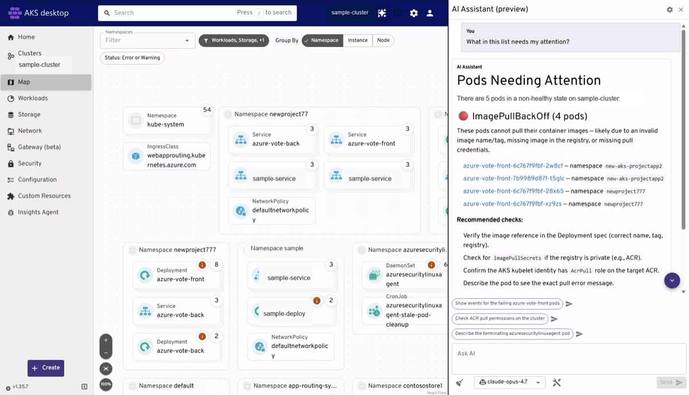
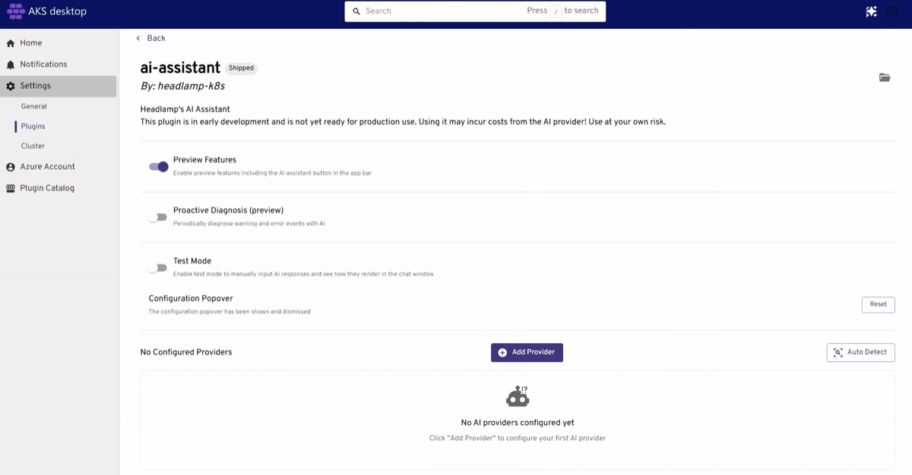
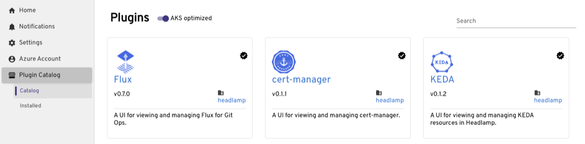

As we have talked with more customers about AKS desktop, one theme has come through clearly: people want help when something goes wrong.

It is easy to show a healthy Kubernetes cluster. The harder and more important moment is when a developer opens an application and asks, “Why is my pod broken, and how do I fix it?”

That question shaped AKS desktop v0.10.0. This is our biggest release so far, not because it has the longest list of features, but because it represents where we believe AKS desktop can provide the most value. We are doubling down on AI-assisted troubleshooting and making it easier to move from seeing a problem to understanding what happened and deciding what to do next.

<!-- truncate -->

## Start with the problem, not the tool

Troubleshooting Kubernetes can require a lot of context. A pod might be restarting, but the cause could be its configuration, a missing dependency, a failed health check, insufficient resources, or something elsewhere in the application.

Finding the answer often means moving between resource views, logs, events, metrics, YAML, and documentation. You need to know where to look before you can begin making progress.

We want AKS desktop to shorten that path.

With the AI Assistant, you can start from the resource that is showing a problem and ask a direct question. The assistant can use the Kubernetes context available in AKS desktop—including resource state, logs, events, and metrics—to help explain what is happening and recommend the next troubleshooting steps.

The goal is not to replace the developer or operator making the decision. It is to help them get oriented faster. Instead of beginning with “Which command should I run?” they can begin with “Why is this failing?”

For example, if a pod is repeatedly restarting, the assistant can help bring together the warning events, recent logs, and workload configuration that might explain the failure. From there, the user can review the evidence, understand the recommendation, and decide how to proceed.

## Make the first investigation easier

We also heard that an AI troubleshooting experience is only useful if it is easy to start using.

AKS desktop can now automatically detect GitHub Copilot as an AI provider. To use Auto Detect, install the GitHub CLI, sign in to a GitHub account with an active GitHub Copilot subscription, and let AKS desktop detect the authenticated session.

For many users, this removes the need to configure another model provider before asking their first troubleshooting question. Organizations that have specific requirements for model selection, compliance, data residency, or existing AI services can still configure a supported provider of their choice.

Whichever provider you choose, the important part is the connection between the model and the environment you are already investigating. The assistant can work with the current cluster context instead of relying only on a manually written description of the problem.

It also stays within the permissions of the active Kubernetes identity. Users choose whether to enable Kubernetes API requests, and the assistant does not receive broader cluster access simply because AI is being used.

## Bring more of your operational knowledge into the experience

Troubleshooting is rarely one-size-fits-all. Teams develop their own checks, conventions, tools, and ways of diagnosing common failures.

Skills make it possible to bring more of that specialized guidance into the AI Assistant. Teams can use built-in skill repositories or add their own, helping the assistant follow the practices that are relevant to their workloads and environments.

We are also introducing support for Model Context Protocol (MCP) servers, which can connect the assistant to additional tools and data sources. These integrations are opt-in, and users can control approval for actions requested by the assistant.

Proactive Diagnosis takes another step toward reducing the time between a problem appearing and someone beginning an investigation. It can surface recent warning and error events with recommendations, giving users a place to start before they have manually assembled all the context themselves.

These capabilities are part of the same direction: make troubleshooting more contextual, more repeatable, and easier to begin.

## Keep AKS desktop focused while making it extensible

AI troubleshooting is the center of this release, but it is not the only way teams need to adapt AKS desktop to their environments.

AKS desktop is built on the open-source Headlamp project, and this release includes an integrated Plugin Catalog. The catalog gives users a way to discover and install focused workflows without requiring every integration to become part of the core application.

This lets the core experience stay focused while teams add the capabilities that fit how they operate Kubernetes. The catalog initially highlights **AKS optimized** plugins that have passed Microsoft accessibility and localization checks, while Official Headlamp plugins can also be explored from the catalog.

## Why this release matters (to me 🤗)

What makes this release important is not any single setting or integration. It is that AKS desktop is becoming more useful in the moment when users need the most help.

When an application is healthy, almost any dashboard can show green status. The real test is what happens when a pod fails, an event raises a warning, or a developer does not know which part of the system to investigate first.

This is our biggest release so far because it moves us closer to a simpler troubleshooting workflow: find the problem, bring the relevant context together, understand the likely cause, and take the next step with confidence.

That is the experience we are working to improve, and I hope that matters to you too!

Download the latest version from the [AKS desktop Releases page](https://github.com/Azure/aks-desktop/releases), try the new AI troubleshooting experience, and tell us where it helps—and where we should keep improving—by [opening an issue](https://github.com/Azure/aks-desktop/issues/new/choose).
