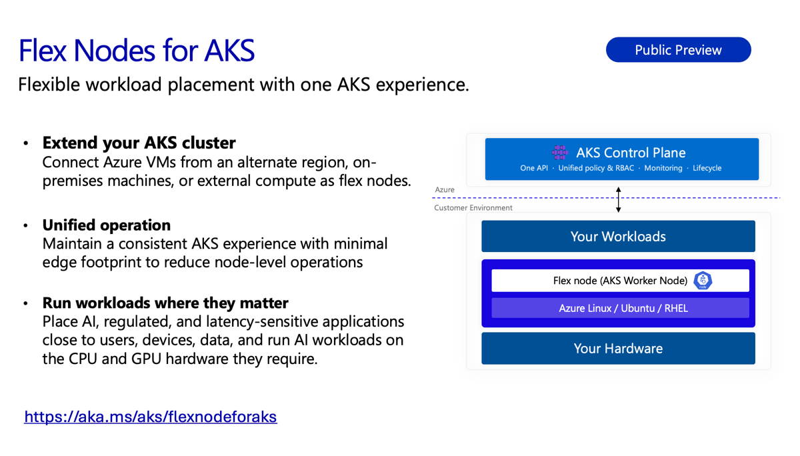

Today, we’re announcing the public preview of flex nodes for AKS, a new capability that lets you extend an existing Azure Kubernetes Service (AKS) cluster with worker nodes in other Azure regions, on-premises or edge environments. These nodes connect to your cluster’s API server over an encrypted overlay network and operate as standard node pools - extending the Kubernetes scheduler, RBAC, policy, and observability you already use without adding another cluster to manage.

<!-- truncate -->

Customers have told us that compute location is rarely a simple choice. Sometimes data cannot contractually leave a specific facility. Sometimes the preferred Azure region is constrained even though suitable capacity is available in another Azure region or on-premises. And sometimes a workload needs to run close to the data, users, or devices it serves to avoid extra latency. Today, each of these situations often means waiting, overprovisioning, or operating another Kubernetes cluster: with another control plane, upgrade cycle, and set of policies. Flex nodes for AKS (preview) is designed to bring that distributed compute into one familiar operating model. Below, we'll explore these common scenarios in more detail.

## Addressing regional CPU and GPU capacity limits

GPU-accelerated training and fine-tuning jobs are often blocked not by cost or quota, but by regional SKU availability - a familiar `SkuNotAvailable` or `AllocationFailed` error when a specific VM size is exhausted in a region. Historically, resolving this meant over-provisioning in advance or standing up and operating a second cluster in a region where capacity exists.

With flex nodes, cluster operators can register capacity from another Azure region, an edge location, or an on-premises data center as a node pool that joins their existing AKS cluster. The scheduler treats these nodes like any other, respecting the labels, taints, and tolerations already defined for the cluster, so pending workloads can be placed on available capacity without standing up and maintaining a parallel cluster and its associated CI/CD or identity configuration.

## Aggregating compute across regions under a single control plane

Many organizations run compute across Azure regions and private data centers but manage each location as a separate cluster stitched together with GitOps and service mesh tooling. Flex nodes bring that distributed capacity into a single AKS control plane, supporting a range of Azure authentication methods like managed identity, Azure Arc, and service principal. Operators retain a single view of the cluster's full footprint through standard tools like kubectl, while workload placement continues to use native Kubernetes primitives, including node affinity, taints and tolerations, and topology spread constraints.

## Workload placement for data residency on-premises

Regulated workloads in healthcare, financial services, and the public sector frequently require that data remain within a specific facility, without managing the lifecycle of a separate on-premises Kubernetes stack. Flex nodes allows on-premises servers to join an AKS cluster as worker nodes. Operators can then use node selectors and taints to pin workloads that must remain local to that hardware, while the remainder of the cluster's workloads run in Azure. Cluster-wide setup remains unified across both environments, and only the data and the compute that processes it stay on-premises.

## Get started today

Flex nodes for AKS is available today in public preview. Documentation, including setup guidance and supported scenarios, is available on Microsoft Learn: [flex nodes for AKS overview](https://aka.ms/aks/flexnodeforaks).
As with all AKS preview features, this release is shaped directly by customer feedback. We're particularly interested in hearing about your capacity and networking use cases, additional provider and hardware scenarios, and any gaps you encounter while testing. Please share feedback through the [AKS Flex Node GitHub repository](https://aka.ms/aks-flex-node/github) and we look forward to seeing what you build!
