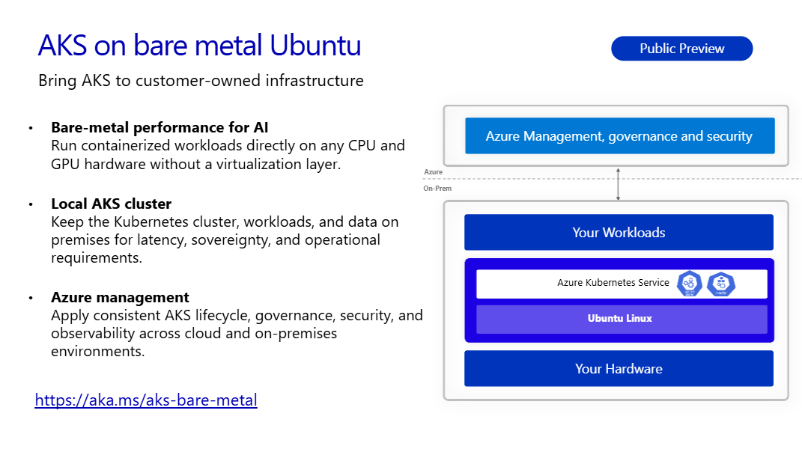

Run Azure Kubernetes Service directly on customer-owned Ubuntu infrastructure with bare metal performance, flexible hardware choices, and consistent management through Azure.

Our vision for Azure Kubernetes Service is simple: customers should be able to run AKS wherever their applications and data need to be.

Today, we are announcing the public preview of AKS on bare metal Ubuntu. Customers can now deploy AKS directly on their Ubuntu infrastructure, without installing or operating a hypervisor between Kubernetes and the underlying hardware.

<!-- truncate -->

This release extends the AKS experience to organizations that need Kubernetes close to their applications, devices, and data. It is designed for environments such as retail locations, factories, branch sites, telecommunications infrastructure, and on-premises AI systems, where performance, latency, hardware access, or data residency are critical.

Earlier this year, we introduced AKS running directly on bare metal Azure Linux through Azure Local small form factor. Support for Ubuntu expands that vision by giving customers another way to run AKS on infrastructure they own while maintaining a consistent Kubernetes and Azure management experience.



## Run AKS directly on Ubuntu infrastructure

Ubuntu is widely deployed across enterprise datacenters, edge environments, and AI infrastructure. Many organizations already have physical Ubuntu servers, established operational practices, and applications built and validated for the Ubuntu ecosystem.

AKS on bare metal Ubuntu allows customers to build on those existing investments. Platform teams can deploy and manage AKS directly on Ubuntu servers, while developers continue using standard Kubernetes APIs and tools.

Removing the virtualization layer also enables Kubernetes workloads to use the available CPU, memory, storage, networking, and accelerator capacity directly. This can improve infrastructure efficiency and provide the hardware access required by performance-sensitive applications.

The Kubernetes control plane, worker capacity, applications, and data remain in the customer’s environment, helping organizations address requirements for low latency, local processing, data sovereignty, and operation in distributed locations.

## Built for AI infrastructure choice

AI applications have diverse infrastructure requirements.

Customers might already own GPUs or specialized accelerators. They might need a particular driver version, device plugin, container runtime, or toolkit for their models and applications. The right configuration can vary significantly based on the hardware, AI framework, and workload.

AKS on bare metal Ubuntu gives customers control over that infrastructure stack. They can select hardware based on workload requirements and configure the supporting GPU software, including:

- GPU drivers
- Kubernetes device plugins
- Container runtimes
- AI frameworks, libraries, and toolkits

This flexibility allows organizations to align Kubernetes with their existing hardware investments and application dependencies rather than adopting a predefined GPU configuration.

Direct access to local hardware and data makes AKS on bare metal Ubuntu well suited for AI inference, computer vision, industrial automation, intelligent retail, telecommunications, and data processing at the edge.

## Get started with a single command

The fastest way to try AKS on bare metal Ubuntu is to run a single command on a  customer-owned Ubuntu machine:

```bash
curl -sSL https://aka.ms/aksbm | bash -s -- -s <subscription-id> -t <tenant-id>
```

This end-to-end quickstart script maintained by the AKS team installs the required Azure tooling, signs the machine into Azure, connects it to Azure Arc if it is not already connected, configures the required Azure providers, and deploys an AKS cluster directly onto the physical server.

### Azure CLI

The public preview provides a streamlined Azure CLI path from a provisioned, Arc enabled Ubuntu machine to a running AKS cluster. With a single Azure Resource Manager deployment command, customers can create the required Azure resources and deploy AKS directly on their physical server.

```bash
az aksarc deploy --resource-group <resource-group-name> --arc-machine-names <machine-name>
```

## Consistent management through Azure

Although applications and data run locally, customers can use familiar AKS and Azure CLI workflows to create and manage their clusters.

AKS on bare metal Ubuntu provides a consistent foundation for:

- Cluster creation and lifecycle management
- Kubernetes upgrades
- Identity and access control
- Governance and policy
- Monitoring and observability
- Security management
- Application delivery using GitOps

This gives platform teams centralized visibility and governance without requiring applications or data to leave the customer’s environment. Developers continue using familiar Kubernetes APIs and tools, while infrastructure teams gain an AKS experience that extends to their Ubuntu infrastructure.

## Available now in public preview

AKS on bare metal Ubuntu is now available in public preview. Customers can deploy AKS directly on supported, customer-owned Ubuntu servers without a hypervisor and manage their clusters using familiar AKS, Azure, and Kubernetes tools.

This preview expands where organizations can run AKS while retaining control over their hardware, GPU software stack, applications, and data.

Get started at [aka.ms/aks-bare-metal](https://aka.ms/aks-bare-metal).
