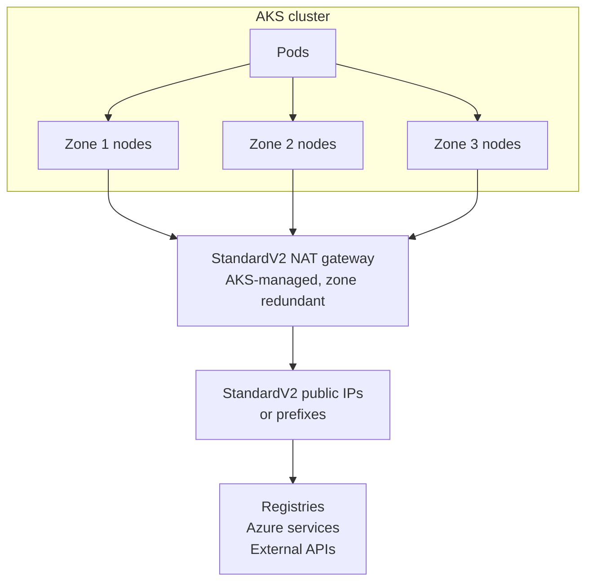

StandardV2 NAT Gateway support for AKS-managed egress is now generally available. When your cluster uses the `managedNATGateway` outbound type, AKS will provision and manage a StandardV2 NAT gateway on your behalf.

StandardV2 is zone redundant by default and supports double the throughput and packets per second compared to Standard SKU. You keep the fully managed experience, and you choose who owns the outbound public IP resources: let Azure create and manage them, or attach your own pre-provisioned StandardV2 public IP addresses and prefixes.

With this release, when using API version `2026-06-01` and beyond, new clusters that use `managedNATGateway` default to StandardV2 in regions where it's available. Existing clusters keep the Standard NAT gateway they already have.

<!-- truncate -->

## Why NAT Gateway for AKS egress?

AKS nodes need outbound connectivity for basic functionality. They talk to the API server, pull container images, download Kubernetes and networking components, and receive node security updates. Your workloads add their own demands: Azure services, external APIs, package repositories, telemetry endpoints, and partner integrations.

Every one of those connections consumes a source network address translation (SNAT) port. As outbound concurrency grows, insufficient SNAT capacity surfaces as intermittent connection failures and timeouts that are time-consuming to diagnose.

Azure NAT Gateway addresses this by providing SNAT for internet-bound traffic at the subnet level. A single NAT gateway serves every subnet you attach it to within the same virtual network, and it hands out SNAT ports on demand to the nodes that need them instead of pre-allocating a fixed block per node. This dynamic allocation uses the available port pool more efficiently and reduces the risk of SNAT port exhaustion because idle nodes don't hold ports that busy nodes could use. Each attached public IP address contributes 64,512 SNAT ports, and a NAT gateway supports up to 16 public IP addresses for each IP version.

When you plan egress capacity, size it against both the [required AKS outbound network rules and FQDNs](https://learn.microsoft.com/azure/aks/outbound-rules-control-egress) and your own application dependencies.

## What StandardV2 adds

| Capability | Standard | StandardV2 |
| --- | --- | --- |
| Availability zones | Single zone | Zone redundant |
| Throughput per NAT gateway | Up to 50 Gbps | Up to 100 Gbps |
| IPv6 outbound addresses | Not supported | Supported |
| Required public IP SKU | Standard | [StandardV2](https://learn.microsoft.com/azure/virtual-network/ip-services/public-ip-addresses#sku), always zone redundant and not interchangeable with Standard |

Zone redundancy is a key enhancement of StandardV2. A Standard NAT gateway operates out of a single availability zone, so a zone-level disruption can impact your cluster's egress traffic. StandardV2 spans every availability zone in the region, so new outbound connections continue to flow through the healthy zones.

The higher throughput ceiling matters for data-heavy clusters that push large volumes to object storage, model registries, or partner endpoints. IPv6 support lets dual-stack clusters use the same managed egress path for both address families.



For a full SKU comparison, see the [Azure NAT Gateway SKU documentation](https://learn.microsoft.com/azure/nat-gateway/nat-sku).

## How the GA API models StandardV2

The generally available API expresses the SKU as a property of the existing outbound type rather than as a new outbound type. Starting with API version `2026-06-01`, newly deployed clusters with `outboundType` set to `managedNATGateway` will default `networkProfile.natGatewayProfile.sku` to `StandardV2` in regions where StandardV2 NAT gateway is available. Otherwise, it will set `sku` to `Standard`. To migrate existing clusters with Standard NAT gateway, update the cluster with `sku` set to `StandardV2` on API version `2026-06-01` or later.

```json
{
  "outboundType": "managedNATGateway",
  "natGatewayProfile": {
    "sku": "StandardV2"
  }
}
```
AKS validates that value against the region and will result in the following behavior:

- **Omit `sku`** and AKS picks the regional default: StandardV2 where it's available, Standard everywhere else. Use this when the same template deploys to many regions.
- **Set `sku` explicitly** and the request has to match what the region supports. Asking for `StandardV2` where it isn't available fails, and so does asking for `Standard` in a region that already supports StandardV2. Both return `UnsupportedOutboundType`.

Existing clusters are unaffected until you act on them. A cluster already running a Standard NAT gateway keeps it, and a request on an earlier API version keeps the previous Standard behavior.

> **Note**: If you used the public preview, the GA API doesn't expose `managedNATGatewayV2` as an outbound type. Preview API versions `2026-01-02-preview` through `2026-05-02-preview` continue to accept `managedNATGatewayV2` until they reach their documented retirement dates, which gives you time to move to `managedNATGateway` with an explicit `sku`. For those dates, see the [AKS Preview API life cycle documentation](https://learn.microsoft.com/azure/aks/concepts-preview-api-life-cycle).

## Choose who owns the outbound IP addresses

The NAT gateway profile also determines where the outbound public IP resources come from. Pick one of the two models below when you create the cluster. You can't combine them, and you can't switch between them for as long as the cluster stays on its current SKU, although you can still adjust counts, addresses, and idle timeout within the model you chose.

### Let Azure manage the outbound IPs

Use `managedOutboundIPProfile` when you want the lowest operational overhead. Specify how many IPv4 and IPv6 addresses AKS should create and manage, with each count accepting a value from 1 through 16. If you omit the IPv4 count, AKS creates one address.

```json
{
  "networkPlugin": "azure",
  "networkPluginMode": "overlay",
  "loadBalancerSku": "standard",
  "ipFamilies": ["IPv4", "IPv6"],
  "podCidrs": ["10.244.0.0/16", "fd12:3456:789a::/64"],
  "serviceCidrs": ["10.0.0.0/16", "fd12:3456:789a:1::/108"],
  "dnsServiceIP": "10.0.0.10",
  "outboundType": "managedNATGateway",
  "natGatewayProfile": {
    "sku": "StandardV2",
    "managedOutboundIPProfile": {
      "count": 2,
      "countIPv6": 1
    },
    "idleTimeoutInMinutes": 30
  }
}
```

This example also configures [Azure CNI Overlay with dual-stack networking](https://learn.microsoft.com/azure/aks/azure-cni-overlay#about-azure-cni-overlay-aks-clusters-with-dual-stack-networking) so the cluster can request both IPv4 and IPv6 managed outbound addresses.

### Bring your own StandardV2 public IPs

Use `outboundIPs`, `outboundIPPrefixes`, or both when downstream systems need to allowlist known, pre-provisioned egress addresses. Create the resources first with the StandardV2 SKU:

```bash
az network public-ip create \
  --resource-group "$RESOURCE_GROUP" \
  --name "$PUBLIC_IP_NAME" \
  --location "$LOCATION" \
  --sku StandardV2 \
  --allocation-method Static \
  --version IPv4 \
  --zone 1 2 3

az network public-ip prefix create \
  --resource-group "$RESOURCE_GROUP" \
  --name "$PUBLIC_IP_PREFIX_NAME" \
  --location "$LOCATION" \
  --length 31 \
  --sku StandardV2 \
  --version IPv4 \
  --zone 1 2 3
```

Then reference the resource IDs in the cluster definition:

```json
{
  "networkPlugin": "azure",
  "loadBalancerSku": "standard",
  "outboundType": "managedNATGateway",
  "natGatewayProfile": {
    "sku": "StandardV2",
    "outboundIPs": {
      "publicIPs": [
        "/subscriptions/<subscription-id>/resourceGroups/<resource-group>/providers/Microsoft.Network/publicIPAddresses/<public-ip-name>"
      ]
    },
    "outboundIPPrefixes": {
      "publicIPPrefixes": [
        "/subscriptions/<subscription-id>/resourceGroups/<resource-group>/providers/Microsoft.Network/publicIPPrefixes/<public-ip-prefix-name>"
      ]
    },
    "idleTimeoutInMinutes": 30
  }
}
```

These resources stay under your control even though AKS manages the NAT gateway itself, and they can carry IPv4 or IPv6 addresses.

> **Note**: Moving to StandardV2 doesn't move your whole cluster to StandardV2 public IPs. The requirement applies only to NAT gateway egress. Inbound traffic to `type: LoadBalancer` Services still flows through the AKS-managed Standard load balancer, which needs Standard public IPs. If you pre-provision public IP inventory, order both SKUs: StandardV2 for NAT gateway egress and Standard for inbound Services.

## Create the cluster

With Azure CLI 2.91.0 or later, set `--outbound-type managedNATGateway`. The SKU defaults to `StandardV2` in a supported region:

```bash
az aks create \
  --resource-group "$RESOURCE_GROUP" \
  --name "$CLUSTER_NAME" \
  --location "$LOCATION" \
  --outbound-type managedNATGateway \
  --nat-gateway-managed-outbound-ip-count 2 \
  --nat-gateway-idle-timeout 30 \
  --generate-ssh-keys
```

On a dual-stack cluster, add `--nat-gateway-managed-outbound-ipv6-count` to request Azure-managed IPv6 addresses as well. That flag requires the StandardV2 SKU.

To bring your own addresses instead, swap the managed counts for your pre-provisioned StandardV2 resource IDs. Supply IPv6 addresses or prefixes here too if the cluster is dual-stack, rather than mixing in the managed count flags, which belong to the other ownership model:

```bash
az aks create \
  --resource-group "$RESOURCE_GROUP" \
  --name "$CLUSTER_NAME" \
  --location "$LOCATION" \
  --outbound-type managedNATGateway \
  --outbound-type-sku StandardV2 \
  --nat-gateway-outbound-ips "$PUBLIC_IP_ID" \
  --nat-gateway-outbound-ip-prefixes "$PUBLIC_IP_PREFIX_ID" \
  --nat-gateway-idle-timeout 30 \
  --generate-ssh-keys
```

Both examples name the SKU explicitly, so they only succeed in regions that support StandardV2. Drop `--outbound-type-sku` to let AKS pick the regional default instead.

Keep the cluster in the same region as those IP resources. A NAT gateway can only attach public IPs from its own region, and `az aks create` falls back to the resource group's location when you omit `--location`.

If the pre-provisioned addresses live outside the cluster's node resource group, the cluster identity also needs permission to attach them. See [Use a managed identity in AKS](https://learn.microsoft.com/azure/aks/use-managed-identity) for granting access to networking resources in another resource group.

If you drive deployments through Azure Resource Manager directly, send the cluster definition with the GA API version:

```bash
URL="https://management.azure.com/subscriptions/${SUBSCRIPTION_ID}/resourceGroups/${RESOURCE_GROUP}/providers/Microsoft.ContainerService/managedClusters/${CLUSTER_NAME}?api-version=2026-06-01"

az rest \
  --method put \
  --url "$URL" \
  --headers "Content-Type=application/json" \
  --body @cluster.json
```

Build `cluster.json` from one of the two ownership models above, wrapped in the usual managed cluster envelope with your `location`, `identity`, `dnsPrefix`, `agentPoolProfiles`, and `linuxProfile` values.

## Confirm the deployment

`effectiveOutboundIPs` is read only. AKS populates it after provisioning, so leave it out of create and update requests. Note that it returns Azure Resource Manager resource references, not literal addresses. Each entry is a resource ID for either a public IP address or a public IP prefix, so resolve them before you put anything into a downstream allowlist:

```bash
URL="https://management.azure.com/subscriptions/${SUBSCRIPTION_ID}/resourceGroups/${RESOURCE_GROUP}/providers/Microsoft.ContainerService/managedClusters/${CLUSTER_NAME}?api-version=2026-06-01"

az rest --method get --url "$URL" \
  --query 'properties.networkProfile.natGatewayProfile.effectiveOutboundIPs[].id' \
  --output tsv |
while read -r resource_id; do
  case "$resource_id" in
    */publicIPPrefixes/*)
      az network public-ip prefix show --ids "$resource_id" --query ipPrefix --output tsv
      ;;
    *)
      az network public-ip show --ids "$resource_id" --query ipAddress --output tsv
      ;;
  esac
done
```

Address references resolve to a single IP address and prefix references resolve to a CIDR range. Allowlist whichever form each entry produces.

To confirm the data path end to end, point `kubectl` at the new cluster and run a short-lived pod that reports its public source address:

```bash
az aks get-credentials \
  --resource-group "$RESOURCE_GROUP" \
  --name "$CLUSTER_NAME" \
  --overwrite-existing

kubectl run natv2-egress-check \
  --image=curlimages/curl:8.12.1 \
  --restart=Never \
  --rm --stdin \
  --command -- curl --fail --silent --show-error https://api.ipify.org
```

The address it returns should match one of the resolved public IP addresses from the previous step, or fall inside one of the resolved prefix ranges.

On a dual-stack cluster, check the IPv6 path separately, because `api.ipify.org` answers over IPv4 only:

```bash
kubectl run natv2-egress-check-v6 \
  --image=curlimages/curl:8.12.1 \
  --restart=Never \
  --rm --stdin \
  --command -- curl --ipv6 --fail --silent --show-error https://api6.ipify.org
```

Follow up by testing the outbound paths your applications actually depend on, including container registries, Azure APIs, and allowlisted partner services.

Ongoing monitoring needs no special setup. Existing Azure NAT Gateway metrics, alerts, and dashboards apply unchanged, so your current SNAT monitoring continues to work against a StandardV2 NAT gateway.

## Move an existing cluster to StandardV2

Existing clusters stay on Standard until you ask for the change. Pass the new SKU to `az aks update`, where `--outbound-type` can be omitted because the cluster already uses `managedNATGateway`:

```bash
az aks update \
  --resource-group "$RESOURCE_GROUP" \
  --name "$CLUSTER_NAME" \
  --outbound-type-sku StandardV2
```

The equivalent REST call sets `sku` to `StandardV2` on API version `2026-06-01` or later. Either way, AKS handles the rest of the migration.

Plan the change as a replacement rather than an upgrade, because that's what happens underneath. AKS removes the Standard NAT gateway and provisions a StandardV2 NAT gateway in its place, reusing the same NAT gateway resource name.

> **Warning**: Your egress IP addresses change during this migration. StandardV2 requires StandardV2 public IP resources, so your existing Standard public IPs can't carry over. Expect existing outbound connections to reset as the NAT gateway is swapped.

How you stage the cutover depends on which ownership model you're moving to. The CLI update above keeps Azure-managed outbound IPs.

If you supply your own StandardV2 addresses, create them first and add them to downstream firewall rules, allowlists, and partner registrations. Then use a REST update on API version `2026-06-01` or later that sets `networkProfile.natGatewayProfile.sku` to `StandardV2`, supplies `outboundIPs`, `outboundIPPrefixes`, or both in that profile, and omits `managedOutboundIPProfile`. Change the SKU and ownership model in the same update: once the cluster is on StandardV2, its ownership model is fixed. Don't use the customer-IP CLI flags for this transition in Azure CLI 2.91.0; they retain the existing managed profile and combine mutually exclusive configurations.

If you keep Azure-managed addresses, the new addresses don't exist until the update creates them, so you can't allowlist them in advance. Plan a maintenance window: run the CLI update above, resolve the new `effectiveOutboundIPs` references to actual addresses, update downstream systems, and then resume production traffic.

Moving to AKS-managed StandardV2 from `loadBalancer` outbound connectivity is supported as well, and the same address-change planning applies. For broader outbound-type concepts and the user-assigned NAT gateway scenarios, see the [AKS NAT gateway documentation](https://learn.microsoft.com/azure/aks/nat-gateway).

## NAT gateway profile properties

The StandardV2 NAT gateway profile supports the following properties:

| Property | Purpose |
| --- | --- |
| `sku` | Selects the NAT Gateway SKU, either `Standard` or `StandardV2`. Omit it to take the regional default. |
| `managedOutboundIPProfile.count` | Number of IPv4 public IP addresses created and managed by Azure. |
| `managedOutboundIPProfile.countIPv6` | Number of IPv6 public IP addresses created and managed by Azure. |
| `outboundIPs.publicIPs` | Resource IDs of customer-defined StandardV2 public IP addresses. |
| `outboundIPPrefixes.publicIPPrefixes` | Resource IDs of customer-defined StandardV2 public IP prefixes. |
| `idleTimeoutInMinutes` | Outbound flow idle timeout, from 4 through 120 minutes. |
| `effectiveOutboundIPs` | Read-only list of the public IP resources currently used for egress. |

The `2026-06-01` API supports both Azure-managed and customer-defined outbound IP configurations. Don't configure `managedOutboundIPProfile` together with `outboundIPs` or `outboundIPPrefixes`.

## Limitations to plan for

| Limitation | What it means for your cluster |
| --- | --- |
| StandardV2 public IP SKU is required | Standard public IP addresses and prefixes aren't compatible with a StandardV2 NAT gateway. |
| Custom IP prefixes aren't supported | If you bring your own IP ranges through Azure Custom IP Prefix, StandardV2 isn't an option today. |
| The outbound IP ownership model is fixed per SKU | Choose between Azure-managed and customer-defined addresses at creation, or at the point you migrate the SKU. |
| Regional availability varies | Check the [StandardV2 regional limitations](https://learn.microsoft.com/azure/nat-gateway/nat-overview#key-limitations-of-standardv2) for your region instead of assuming parity across the fleet. |
| Azure quotas still apply | Public IP and subscription limits constrain how far you can scale outbound addresses. |

Dual-stack clusters have one extra design point to work through. `outboundType` is a single cluster-wide setting that governs IPv4 and IPv6 together, so you can't route one address family through a NAT gateway and the other through load balancer outbound rules. That makes StandardV2 the only managed NAT gateway option for dual-stack egress, because the Standard SKU handles IPv4 only. If you'd rather keep both families on load balancer outbound rules, choose `loadBalancer` as the outbound type instead. If you manage your own NAT gateway with `userAssignedNATGateway`, review the [Azure NAT Gateway SKU documentation](https://learn.microsoft.com/azure/nat-gateway/nat-sku) for subnet-level constraints that AKS-managed egress doesn't expose you to.

More broadly, for traffic whose next hop is the internet, the NAT gateway takes precedence over load balancer outbound rules, instance-level public IPs, and Azure Firewall, so connections that previously used those paths may be interrupted when it attaches. A user-defined route is the exception: traffic doesn't pass through the NAT gateway at all when a route sends `0.0.0.0/0` to a network virtual appliance or a virtual network gateway.

Finally, the SKU change is one way. You can move from Standard to StandardV2, but you can't downgrade a StandardV2 NAT gateway back to Standard.

## Get started

StandardV2 gives AKS-managed egress a zone-redundant foundation, higher throughput and bandwidth, and a choice between hands-off and fully controlled outbound addressing. New clusters in supported regions pick it up automatically on API version `2026-06-01`, and existing clusters move when you're ready.

Try it on a nonproduction cluster first, confirm the effective outbound IPs, and validate the egress paths your applications depend on. To go deeper:

- [Create a managed or user-assigned NAT gateway for AKS](https://learn.microsoft.com/azure/aks/nat-gateway)
- [Customize AKS cluster egress with outbound types](https://learn.microsoft.com/azure/aks/egress-outboundtype)
- [Review required AKS outbound network rules and FQDNs](https://learn.microsoft.com/azure/aks/outbound-rules-control-egress)
- [Understand Azure NAT Gateway resources and SKUs](https://learn.microsoft.com/azure/nat-gateway/nat-gateway-resource)
- [Track AKS regional releases](https://releases.aks.azure.com/AKSRelease)

Tell us how it goes. Report issues or suggest improvements through the [AKS GitHub repository](https://github.com/Azure/AKS/issues).
