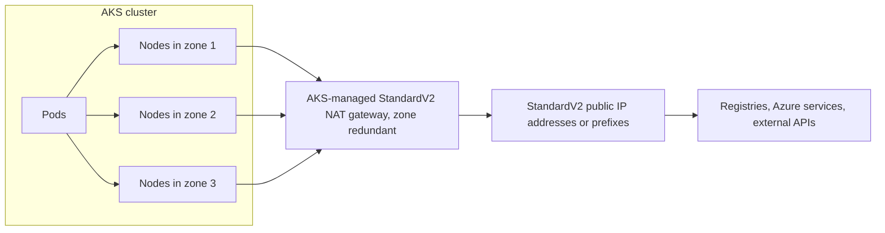

StandardV2 NAT Gateway support for AKS-managed egress is now generally available. When your cluster uses the `managedNATGateway` outbound type, AKS can provision and manage a StandardV2 NAT gateway on your behalf.

StandardV2 is zone redundant by default and doubles the throughput ceiling of the Standard SKU. You keep the fully managed experience, and you choose who owns the outbound public IP resources: let Azure create and manage them, or attach your own pre-provisioned StandardV2 public IP addresses and prefixes.

One behavior change deserves your attention before you upgrade tooling. Starting with API version `2026-06-01`, new clusters that use `managedNATGateway` default to StandardV2 in regions where it's available. Existing clusters keep the Standard gateway they already have.

<!-- truncate -->

## Why cluster egress needs a bigger envelope

AKS nodes need outbound connectivity just to function. They talk to the API server, pull container images, download Kubernetes and networking components, and receive node security updates. Your workloads add their own demands: Azure services, external APIs, package repositories, telemetry endpoints, and partner integrations.

Every one of those connections consumes a source network address translation (SNAT) port. As outbound concurrency grows, thin SNAT capacity surfaces as intermittent connection failures and timeouts that are frustrating to diagnose.

Azure NAT Gateway addresses this by providing SNAT for internet-bound traffic at the subnet level. A single gateway serves every subnet you attach it to within the same virtual network, and it hands out SNAT ports on demand to the nodes that need them instead of pre-allocating a fixed block per node. Each attached public IP address contributes 64,512 SNAT ports, and one gateway supports up to 16 addresses.

When you plan egress capacity, size it against both the [required AKS outbound network rules and FQDNs](https://learn.microsoft.com/azure/aks/outbound-rules-control-egress) and your own application dependencies.

## What StandardV2 adds

| Capability | Standard | StandardV2 |
| --- | --- | --- |
| Availability zones | Single zone | Zone redundant |
| Throughput per gateway | Up to 50 Gbps | Up to 100 Gbps |
| IPv6 outbound addresses | Not supported | Supported |
| Required public IP SKU | Standard | StandardV2 |

Zone redundancy is the headline. A Standard NAT gateway operates out of a single availability zone, so a zone-level disruption takes your cluster egress with it. StandardV2 spans every availability zone in the region, so new outbound connections continue to flow through the healthy zones.

The higher throughput ceiling matters for data-heavy clusters that push large volumes to object storage, model registries, or partner endpoints. IPv6 support lets dual-stack clusters use the same managed egress path for both address families.



For a full SKU comparison, see the [Azure NAT Gateway SKU documentation](https://learn.microsoft.com/azure/nat-gateway/nat-sku).

## How the GA API models StandardV2

The generally available API expresses the SKU as a property of the existing outbound type rather than as a new outbound type. Starting with API version `2026-06-01`, set `networkProfile.natGatewayProfile.sku` to either `Standard` or `StandardV2`:

```json
{
  "outboundType": "managedNATGateway",
  "natGatewayProfile": {
    "sku": "StandardV2"
  }
}
```

Three defaulting rules follow from that design:

1. A new cluster that omits `sku` on API version `2026-06-01` or later gets StandardV2 wherever the region supports it, and Standard everywhere else.
2. An existing cluster with a Standard gateway keeps it. AKS backfills `natGatewayProfile.sku` as the read-only value `Standard` in GET responses so the configuration is explicit without changing the deployed resource.
3. A request on an earlier API version keeps the previous Standard behavior.

> **Note**: If you used the public preview, the GA API doesn't expose `managedNATGatewayV2` as an outbound type. Preview API versions `2026-01-02-preview` through `2026-05-02-preview` continue to accept `managedNATGatewayV2` for around one year, which gives you time to move to `managedNATGateway` with an explicit `sku`. For deprecation dates of the preview APIs, see the [AKS Preview API life cycle documentation](https://learn.microsoft.com/en-us/azure/aks/concepts-preview-api-life-cycle).

## Choose who owns the outbound IP addresses

The NAT gateway profile also determines where the outbound public IP resources come from. Pick one of the two models below when you create the cluster. You can't combine them, and you can't switch between them afterward, although you can still adjust counts, addresses, and idle timeout within the model you chose.

### Let Azure manage the outbound IPs

Use `managedOutboundIPProfile` when you want the lowest operational overhead. Specify how many IPv4 and IPv6 addresses AKS should create and manage, with each count accepting a value from 1 through 16. If you omit the IPv4 count, AKS creates one address.

```json
{
  "networkPlugin": "azure",
  "networkPluginMode": "overlay",
  "loadBalancerSku": "standard",
  "ipFamilies": ["IPv4", "IPv6"],
  "podCidrs": ["10.244.0.0/16", "fd12:3456:789a::/64"],
  "serviceCidrs": ["10.0.0.0/16", "fd12:3456:789a:1::/108"],
  "dnsServiceIP": "10.0.0.10",
  "outboundType": "managedNATGateway",
  "natGatewayProfile": {
    "sku": "StandardV2",
    "managedOutboundIPProfile": {
      "count": 2,
      "countIPv6": 1
    },
    "idleTimeoutInMinutes": 30
  }
}
```

This example also configures [Azure CNI Overlay with dual-stack networking](https://learn.microsoft.com/azure/aks/azure-cni-overlay#about-azure-cni-overlay-aks-clusters-with-dual-stack-networking) so the cluster can request both IPv4 and IPv6 managed outbound addresses.

### Bring your own StandardV2 public IPs

Use `outboundIPs`, `outboundIPPrefixes`, or both when downstream systems need to allowlist known, pre-provisioned egress addresses. Create the resources first with the StandardV2 SKU:

```bash
az network public-ip create \
  --resource-group "$RESOURCE_GROUP" \
  --name "$PUBLIC_IP_NAME" \
  --location "$LOCATION" \
  --sku StandardV2 \
  --allocation-method Static \
  --version IPv4 \
  --zone 1 2 3

az network public-ip prefix create \
  --resource-group "$RESOURCE_GROUP" \
  --name "$PUBLIC_IP_PREFIX_NAME" \
  --location "$LOCATION" \
  --length 31 \
  --sku StandardV2 \
  --version IPv4 \
  --zone 1 2 3
```

Then reference the resource IDs in the cluster definition:

```json
{
  "networkPlugin": "azure",
  "loadBalancerSku": "standard",
  "outboundType": "managedNATGateway",
  "natGatewayProfile": {
    "sku": "StandardV2",
    "outboundIPs": {
      "publicIPs": [
        "/subscriptions/<subscription-id>/resourceGroups/<resource-group>/providers/Microsoft.Network/publicIPAddresses/<public-ip-name>"
      ]
    },
    "outboundIPPrefixes": {
      "publicIPPrefixes": [
        "/subscriptions/<subscription-id>/resourceGroups/<resource-group>/providers/Microsoft.Network/publicIPPrefixes/<public-ip-prefix-name>"
      ]
    },
    "idleTimeoutInMinutes": 30
  }
}
```

These resources stay under your control even though AKS manages the gateway itself, and they can carry IPv4 or IPv6 addresses.

> **Note**: The StandardV2 public IP requirement applies only to NAT gateway egress. The AKS-managed load balancer that serves `type: LoadBalancer` Services is still a Standard load balancer and needs Standard public IPs. If you pre-provision public IP inventory, plan for both SKUs.

## Create the cluster

Azure CLI support for selecting the SKU is on the way. Until it ships, send the cluster definition through the Azure Resource Manager REST API with the GA API version:

```bash
URL="https://management.azure.com/subscriptions/${SUBSCRIPTION_ID}/resourceGroups/${RESOURCE_GROUP}/providers/Microsoft.ContainerService/managedClusters/${CLUSTER_NAME}?api-version=2026-06-01"

az rest \
  --method put \
  --url "$URL" \
  --headers "Content-Type=application/json" \
  --body @cluster.json
```

Build `cluster.json` from one of the two ownership models above, wrapped in the usual managed cluster envelope with your `location`, `identity`, `dnsPrefix`, `agentPoolProfiles`, and `linuxProfile` values.

## Confirm the SKU you actually got

This step isn't optional. Because AKS falls back to Standard in regions where StandardV2 isn't available, a successful cluster creation doesn't by itself prove you're running StandardV2. Read the SKU back:

```bash
az rest \
  --method get \
  --url "$URL" \
  --query '{
    provisioningState: properties.provisioningState,
    outboundType: properties.networkProfile.outboundType,
    sku: properties.networkProfile.natGatewayProfile.sku,
    effectiveOutboundIPs: properties.networkProfile.natGatewayProfile.effectiveOutboundIPs
  }'
```

`effectiveOutboundIPs` is read only. AKS populates it after provisioning, so leave it out of create and update requests. The addresses it lists are the ones your workloads egress from, which makes it the right source for downstream allowlists.

To confirm the data path end to end, run a short-lived pod that reports its public source address:

```bash
kubectl run natv2-egress-check \
  --image=curlimages/curl:8.12.1 \
  --restart=Never \
  --rm --stdin \
  --command -- curl --fail --silent --show-error https://api.ipify.org
```

The address it returns should match one of the entries in `effectiveOutboundIPs`. Follow up by testing the outbound paths your applications actually depend on, including container registries, Azure APIs, and allowlisted partner services.

## Move an existing cluster to StandardV2

Existing clusters stay on Standard until you ask for the change, and you request it by updating the cluster with `sku` set to `StandardV2` on API version `2026-06-01` or later. AKS handles the rest.

Plan the change as a replacement rather than an upgrade, because that's what happens underneath. AKS removes the Standard gateway and provisions a StandardV2 gateway in its place, reusing the same NAT gateway resource name.

> **Warning**: Your egress IP addresses change during this migration. StandardV2 requires StandardV2 public IP resources, so your existing Standard public IPs can't carry over. Capture the new `effectiveOutboundIPs` values and update every downstream firewall rule, allowlist, and partner registration before you cut over production traffic. Expect existing outbound connections to reset as the gateway is swapped.

Migration guidance and the current supported paths, including moving from load balancer outbound connectivity, live in the [AKS NAT gateway documentation](https://learn.microsoft.com/azure/aks/nat-gateway).

## NAT gateway profile properties

The StandardV2 NAT gateway profile supports the following properties:

| Property | Purpose |
| --- | --- |
| `sku` | Selects the NAT Gateway SKU. Use `StandardV2` for the configuration described in this post. |
| `managedOutboundIPProfile.count` | Number of IPv4 public IP addresses created and managed by Azure. |
| `managedOutboundIPProfile.countIPv6` | Number of IPv6 public IP addresses created and managed by Azure. |
| `outboundIPs.publicIPs` | Resource IDs of customer-defined StandardV2 public IP addresses. |
| `outboundIPPrefixes.publicIPPrefixes` | Resource IDs of customer-defined StandardV2 public IP prefixes. |
| `idleTimeoutInMinutes` | Outbound flow idle timeout, from 4 through 120 minutes. |
| `effectiveOutboundIPs` | Read-only list of the public IP resources currently used for egress. |

The `2026-06-01` API supports both Azure-managed and customer-defined outbound IP configurations. Don't configure `managedOutboundIPProfile` together with `outboundIPs` or `outboundIPPrefixes`.

## Limitations to plan for

| Limitation | What it means for your cluster |
| --- | --- |
| StandardV2 public IP SKU is required | Standard public IP addresses and prefixes aren't compatible with a StandardV2 gateway. |
| Custom IP prefixes aren't supported | If you bring your own IP ranges through Azure Custom IP Prefix, StandardV2 isn't an option today. |
| The outbound IP ownership model is fixed | Decide between Azure-managed and customer-defined addresses at creation time. |
| Regional availability varies | Check the [StandardV2 regional limitations](https://learn.microsoft.com/azure/nat-gateway/nat-overview#key-limitations-of-standardv2) for your region instead of assuming parity across the fleet. |
| Azure quotas still apply | Public IP and subscription limits constrain how far you can scale outbound addresses. |

One known issue deserves a closer look if you run dual-stack clusters. Attaching a StandardV2 NAT gateway to a subnet disrupts IPv6 outbound traffic that relies on load balancer outbound rules. If you need both address families and depend on those rules, use load balancer outbound rules for both, or pair a Standard NAT gateway for IPv4 with load balancer outbound rules for IPv6. More broadly, outbound connections that previously used a load balancer, Azure Firewall, or instance-level public IPs may be interrupted when the gateway attaches, because all new outbound connections move to the NAT gateway.

Finally, the SKU change is one way. You can move from Standard to StandardV2, but you can't downgrade a StandardV2 gateway back to Standard.

## How we validated it

Before GA, we tested the integration at scale. A 1,003-node StandardV2 cluster came up with every node reporting `Ready`, and a follow-up workload issued 20,000 outbound requests with no dropped connections and even distribution across all 16 attached StandardV2 public IP addresses.

Functional testing covered IPv4, IPv6, and dual-stack clusters across multiple regions, along with Linux-only and mixed Linux and Windows node pools. Windows scenarios included scaling deployments, rolling restarts, and user node pool deletion.

Observability needs no special setup. Existing Azure NAT Gateway metrics, alerts, and dashboards apply unchanged, so your current SNAT monitoring continues to work against the new gateway.

## Get started

StandardV2 gives AKS-managed egress a zone-redundant foundation, a higher throughput ceiling, and a choice between hands-off and fully controlled outbound addressing. New clusters in supported regions pick it up automatically on API version `2026-06-01`, and existing clusters move when you're ready.

Try it on a nonproduction cluster first, confirm the SKU and effective outbound IPs, and validate the egress paths your applications depend on. To go deeper:

- [Create a managed or user-assigned NAT gateway for AKS](https://learn.microsoft.com/azure/aks/nat-gateway)
- [Customize AKS cluster egress with outbound types](https://learn.microsoft.com/azure/aks/egress-outboundtype)
- [Review required AKS outbound network rules and FQDNs](https://learn.microsoft.com/azure/aks/outbound-rules-control-egress)
- [Understand Azure NAT Gateway resources and SKUs](https://learn.microsoft.com/azure/nat-gateway/nat-gateway-resource)
- [Track AKS regional releases](https://releases.aks.azure.com/AKSRelease)

Tell us how it goes. Report issues or suggest improvements through the [AKS GitHub repository](https://github.com/Azure/AKS/issues).
